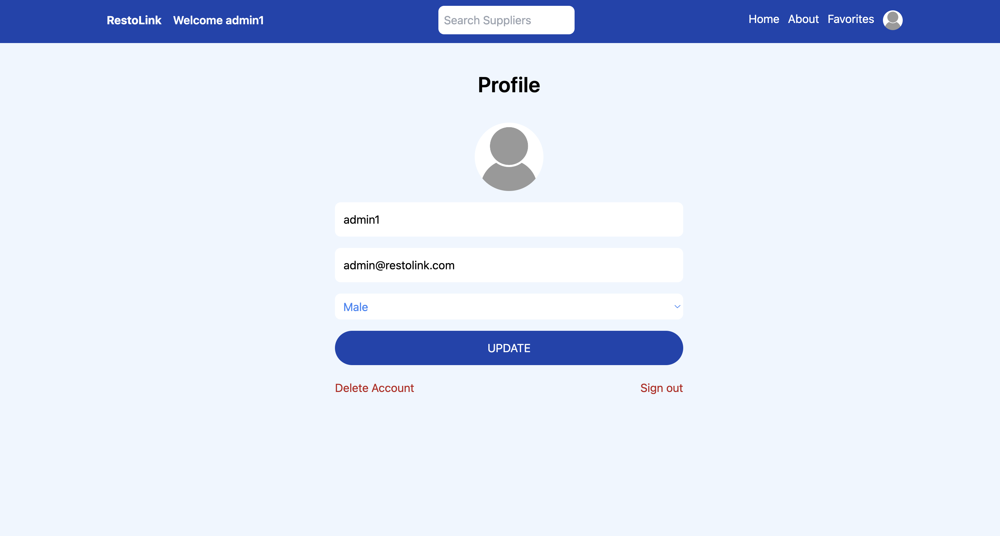
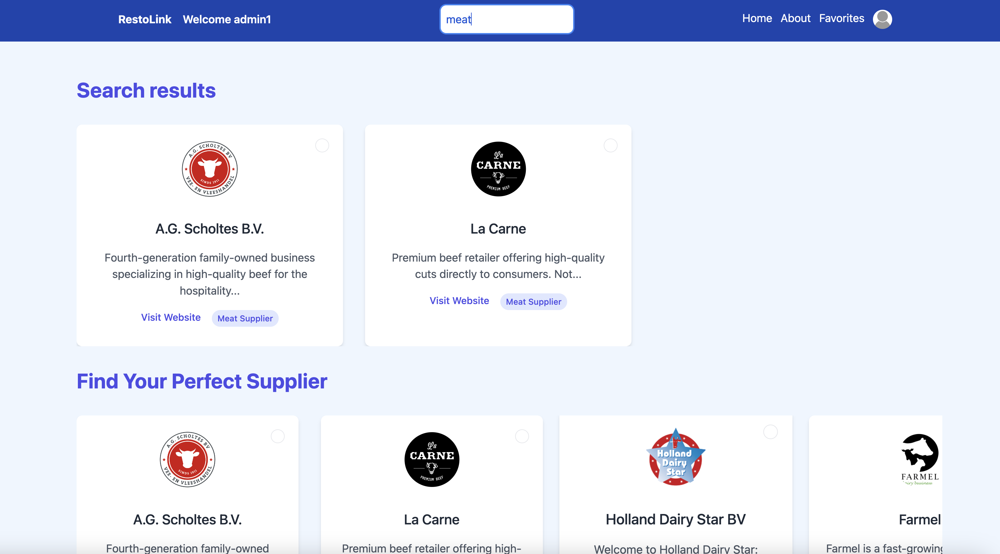
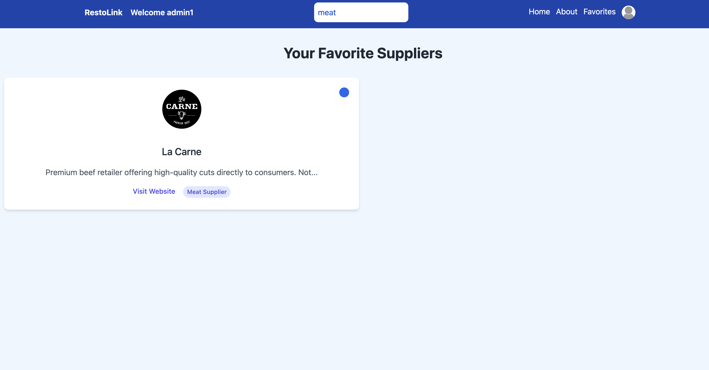

# RestoLink

Struggling to find the perfect ingredients or equipment for your restaurant? RestoLink is your one-stop shop for all your restaurant needs! This app connects restaurant owners and suppliers, making it easier than ever to find the products you need to run your business.

Restaurant Owners: Browse a wide variety of restaurant supplies from trusted vendors, and contact suppliers directly.

Restaurant Suppliers: Showcase your products, reach a wider audience of restaurant owners, and manage leads and inquiries directly through the app.

RestoLink offers a user-friendly platform with a focus on clear communication and efficient connections.

## Screenshots

<div align="center">
  <p>Edit You profile</p>
  
  <p>Browse all suppliers</p>
  
  <p>Check you Favorites</p>
  
</div>


## Getting started

1. Clone the repo
```
git clone git@github.com:Charbel-R/RestoLink.git
```
2. Install dependencies and run Project
```
Client Side: cd client ===> npm install ===> npm run dev
```
```
Server: cd server ===> npm install ==> node index.js
```


## Built with
 [![React.js][React.js]][React-url]
 [![Redux][Redux]][Redux-url]
 [![MongoDB][Mongo-Db]][Mongo-Db-url]
 [![JWT][JWT]][JWT]
 [![Express.js][Express.js]][Express.js]
 [![TailwindCSS][TailwindCSS]][TailwindCSS-url]
 [![Git][Git]][Git-url]
 [![GitHub][GitHub]][GitHub-url]
 [![Prettier][Prettier]][Prettier-url]


## Contributing

Improvements are welcome :)

Fork the repo and do your thing. Push to your fork and submit a pull request.


## Author

Charbel Rouhana - [Github](https://github.com/Charbel-r) - [LinkedIn](https://www.linkedin.com/in/charbel-rouhana-0b6311135/)


[React.js]: https://img.shields.io/badge/React-20232A?style=for-the-badge&logo=react&logoColor=61DAFB
[React-url]: https://reactjs.org/

[Prettier]: https://img.shields.io/badge/prettier-1A2C34?style=for-the-badge&logo=prettier&logoColor=F7BA3E
[Prettier-url]: https://prettier.io/

[Git-url]: https://git-scm.com/
[Git]: https://img.shields.io/badge/GIT-E44C30?style=for-the-badge&logo=git&logoColor=white

[GitHub-url]: https://github.com/
[GitHub]: https://img.shields.io/badge/GitHub-100000?style=for-the-badge&logo=github&logoColor=white

[JWT]: https://img.shields.io/badge/JWT-black?style=for-the-badge&logo=JSON%20web%20tokens
[JWT-url]: https://jwt.io/introduction

[Redux]: https://img.shields.io/badge/redux-%23593D88?style=for-the-badge&logo=redux&logoColor=white
[Redux-url]: https://redux-toolkit.js.org/

[Mongo-Db]: https://img.shields.io/badge/MongoDB-%234ea94b.svg?style=for-the-badge&logo=mongodb&logoColor=white
[Mongo-Db-url]: https://www.mongodb.com/docs/atlas/getting-started/

[TailwindCSS]: https://img.shields.io/badge/tailwindcss-%2338B2AC.svg?style=for-the-badge&logo=tailwind-css&logoColor=white
[TailwindCSS-url]: https://tailwindcss.com/docs/installation

[Express.js]: https://img.shields.io/badge/express.js-%23404d59.svg?style=for-the-badge&logo=express&logoColor=%2361DAFB
[Express.js-url]: https://expressjs.com/en/starter/installing.html